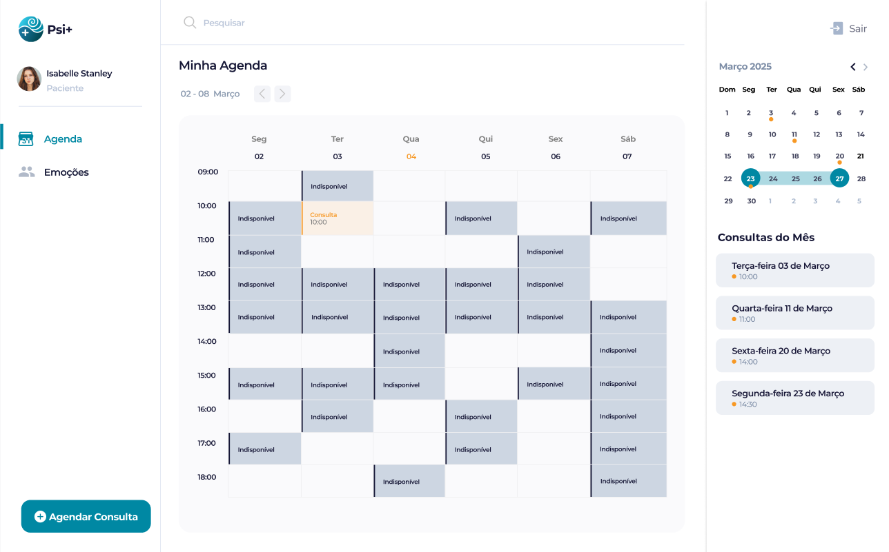

## 6. Interface do sistema

_A sessão a seguir apresenta a descrição do produto de software desenvolvido, com foco nas principais interfaces da plataforma e sua interação com o usuário._

---

### 6.1. Telas do Processo 1: Cadastro e Gestão da Agenda (Psicólogo)

_Descrição das telas relativas ao processo de cadastro e gestão da agenda do psicólogo, permitindo a organização eficiente da disponibilidade._

#### 6.1.1. Cadastro da Agenda

_Nesta tela, o psicólogo pode definir seus horários de atendimento, marcando blocos como disponíveis ou indisponíveis, além de configurar horários de expediente padrão e realizar ajustes pontuais._

**Comandos**

| **Comandos** | **Destino** | **Tipo** |
| --- | --- | --- |
| `salvar` | Horário é atualizado | default |
| `cancelar` | Processo é cancelado | cancel |

#### 6.1.2. Visualizar Agenda Atualizada

_Após as alterações, o psicólogo visualiza sua agenda com as definições aplicadas, refletindo sua disponibilidade atualizada._

**Comandos**

| **Comandos** | **Destino** | **Tipo** |
| --- | --- | --- |
| `novoPaciente` | Enviar para Processo Cadastrar Paciente | --- |
| `novaConsulta` | Enviar para Processo Cadastrar Consulta | --- |

---

### 6.2. Telas do Processo 2: Agendamento de Paciente (Paciente)

_Descrição das telas relativas ao processo de agendamento de um horário por parte do paciente, desde a visualização da agenda até a confirmação._

#### 6.2.1. Visualizar Agenda (Paciente)

_O paciente tem acesso à agenda do psicólogo, podendo identificar os horários disponíveis para agendamento._

| **Comandos** | **Destino** | **Tipo** |
| --- | --- | --- |
| `agendarConsulta` | Abrir popup de agendamento | --- |
| `botaoEmocoes` | Ir para o processo Gestão das emoções | --- |

#### 6.2.2. Tela de Confirmação de Agendamento

_Ao selecionar um horário, o paciente é direcionado para uma tela de confirmação antes de finalizar o agendamento._

**Comandos**

| **Comandos** | **Destino** | **Tipo** |
| --- | --- | --- |
| `confirmar` | Horário é reservado para o paciente | default |
| `cancelar` | Processo é cancelado | cancel |

#### 6.3.3. Visualizar Agenda Atualizada

_Após a confirmação ou cancelamento, a agenda é atualizada para refletir o status do agendamento._

**Comandos**

| **Comandos** | **Destino** | **Tipo** |
| --- | --- | --- |
| `agendarConsulta` | Abrir popup de agendamento | --- |
| `botaoEmocoes` | Ir para o processo Gestão das emoções | --- |

---

### 6.3. Telas do Processo 3: Cadastro e Gestão do Paciente (Psicólogo)

_Este processo centraliza a organização e atualização dos dados dos pacientes, desde o cadastro inicial até a consulta de históricos e estatísticas._

#### 6.3.1. Cadastro de Paciente

_Tela para registrar informações detalhadas do paciente, como dados pessoais, endereço e informações complementares._

**Comandos**

| **Comandos** | **Destino** | **Tipo** |
| --- | --- | --- |
| `Salvar` | Confirma o cadastro e armazena os dados | default |

#### 6.3.2. Pesquisa de Perfil do Paciente

_Interface para localizar pacientes de forma rápida e eficiente, utilizando diversos critérios de pesquisa._

**Comandos**

| **Comandos** | **Destino** | **Tipo** |
| --- | --- | --- |
| `Mais Recentes` | Filtra e organiza os pacientes do cadastro mais recente para o mais antigo | Filtro |

#### 6.3.3. Arquivamento de Paciente

_Permite mover pacientes para um status de "arquivado", facilitando a organização da lista de pacientes ativos._

**Comandos**

| **Comandos** | **Destino** | **Tipo** |
| --- | --- | --- |
| `Arquivar` | Move os pacientes selecionados para a página "Pacientes Arquivados" | Lista de Arquivados |

#### 6.3.4. Atualização de Dados do Paciente

_Tela para editar informações de pacientes já cadastrados, garantindo que os dados estejam sempre atualizados._

**Comandos**

| **Comandos** | **Destino** | **Tipo** |
| --- | --- | --- |
| `Salvar` | Confirma a alteração e armazena os dados | default |

#### 6.3.5. Consulta ao Histórico Clínico

_Visão detalhada do histórico de interações com o paciente, incluindo consultas, estatísticas de emoções e calendário de emoções._

**Comandos**

| **Comandos** | **Destino** | **Tipo** |
| --- | --- | --- |
| `Histórico de consultas` | Exibe o histórico de consultas do paciente | Navegação |
| `Estatísticas das Emoções` | Exibe as estatísticas das emoções do paciente | Navegação |
| `Calendário de Emoções` | Exibe o calendário de emoções do paciente | Navegação |

---

### 6.4. Telas do Processo 4: Registro de Anotações da Consulta (Psicólogo)

_Descrição da tela para o registro de anotações das consultas, permitindo aos profissionais inserirem informações importantes sobre os atendimentos realizados._

#### 6.4.1. Tela de Registro de Sessão

_A tela principal para inserir anotações de uma consulta, onde o psicólogo pode visualizar anotações existentes e adicionar novas._

**Comandos**

| **Comandos** | **Destino** | **Tipo** |
| --- | --- | --- |
| `inserirAnotacoes` | Permite inserir novas anotações | - |

---

### 6.5. Telas do Processo 5: Gestão do Registro de Anotações da Consulta (Psicólogo)

_Permite aos profissionais consultar e gerenciar o histórico de anotações das consultas realizadas, facilitando o acompanhamento do paciente._

#### 6.5.1. Tela de Gestão de Registros

_Interface para pesquisar e exibir os registros de anotações das consultas, garantindo a organização eficiente das informações._

**Comandos**

| **Comandos** | **Destino** | **Tipo** |
| --- | --- | --- |
| `Exibir anotação` | Exibir anotações do paciente | Área de texto |
| `Selecionar` | Gráficos e anotações | Tabela |
| `Adicionar anotações` | Registrar anotação | - |

---

### 6.6. Telas do Processo 6: Gestão das Emoções e Calendário

_Este módulo oferece funcionalidades para pacientes registrarem suas emoções e para psicólogos visualizarem e analisarem esses registros._

#### 6.6.1. Calendário de Emoções do Paciente (Psicólogo)

_Permite ao psicólogo visualizar o calendário de emoções do paciente, identificando padrões e momentos de maior impacto emocional para um acompanhamento mais preciso._

| **Comandos** | **Destino** | **Tipo** |
| --- | --- | --- |
| `Histórico de consultas` | Exibe o histórico de consultas do paciente | Navegação |
| `Estatísticas das Emoções` | Exibe as estatísticas das emoções do paciente | Navegação |
| `Calendário de Emoções` | Exibe o calendário de emoções do paciente | Navegação |
| `Novo Paciente` | Envia para a tela de cadastro de novo paciente | Navegação |
| `Nova Consulta` | Envia para a tela de cadastro de nova consulta | Navegação |
| `Agenda` | Envia para a tela de agenda | Navegação |
| `Pacientes` | Envia para a tela de pacientes | Navegação |

#### 6.6.2. Emoção do Paciente (Visualização pelo Psicólogo)

_Quando uma emoção é selecionada no calendário, esta tela exibe os detalhes da emoção registrada pelo paciente, oferecendo insights valiosos._

| **Comandos** | **Destino** | **Tipo** |
| --- | --- | --- |
| `Fechar` | Cancela a visualização da emoção | cancel |

#### 6.6.3. Estatísticas de Emoções do Paciente (Psicólogo)

_Exibe gráficos e estatísticas baseados nos registros de emoções do paciente, oferecendo uma análise visual do progresso emocional ao longo do tempo._

| **Comandos** | **Destino** | **Tipo** |
| --- | --- | --- |
| `Histórico de consultas` | Exibe o histórico de consultas do paciente | Navegação |
| `Estatísticas das Emoções` | Exibe as estatísticas das emoções do paciente | Navegação |
| `Calendário de Emoções` | Exibe o calendário de emoções do paciente | Navegação |
| `Novo Paciente` | Envia para a tela de cadastro de novo paciente | Navegação |
| `Nova Consulta` | Envia para a tela de cadastro de nova consulta | Navegação |
| `Agenda` | Envia para a tela de agenda | Navegação |
| `Pacientes` | Envia para a tela de pacientes | Navegação |

#### 6.6.4. Calendário de Emoções (Paciente)

_Página dedicada ao paciente para registrar suas emoções diariamente e visualizá-las de forma organizada em um formato de calendário._

| **Comandos** | **Destino** | **Tipo** |
| --- | --- | --- |
| `Agenda` | Envia para a tela de agenda | Navegação |
| `Emoções` | Exibe o calendário de emoções do paciente | Navegação |
| `Agendar Consulta` | Envia para a tela de agendamento de consulta | Navegação |
| `Seleção emoção` | Envia para a tela de edição de emoção | Navegação |
| `Seleção dia` | Envia para a tela de cadastro de emoção | Navegação |

#### 6.6.5. Cadastro de Emoção (Paciente)

_Tela para o paciente registrar uma nova emoção, incluindo detalhes como sentimento, data, horário e uma breve descrição._

| **Comandos** | **Destino** | **Tipo** |
| --- | --- | --- |
| `Salvar` | Adiciona a emoção no banco | default |
| `Cancelar` | Cancela a gestão da emoção | cancel |

#### 6.6.6. Edição de Emoção (Paciente)

_Permite ao paciente modificar ou excluir uma emoção previamente registrada, mantendo seu histórico emocional sempre atualizado._

| **Comandos** | **Destino** | **Tipo** |
| --- | --- | --- |
| `Editar Emoção` | Salva os novos dados da emoção no banco | default |
| `Deletar Emoção` | Remove os dados da emoção do banco | remover |
|
