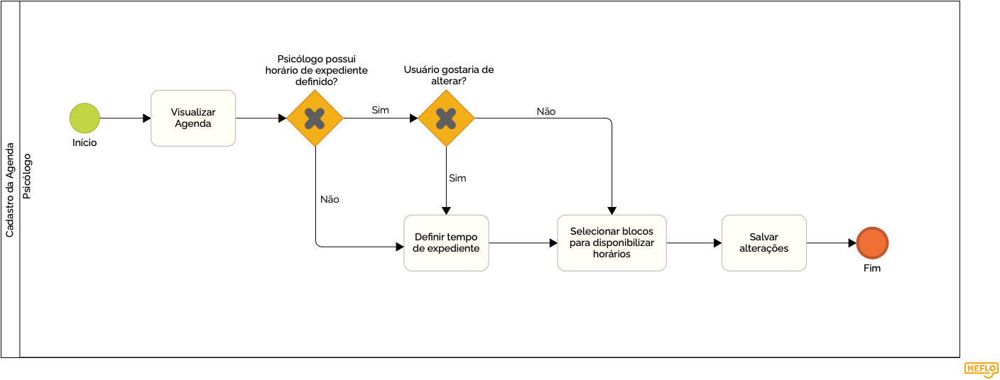

### 3.3.1 Processo 1 – Cadastro da agenda
O processo de agendamento no Psi+ permite que psicólogos cadastrem horários como disponíveis ou indisponíveis e definir um horário de expediente. Por padrão, todos os horários são definidos como indisponíveis. A interface permite que o profissional selecione blocos de horários diretamente na grade semanal para marcar como disponíveis. Além disso, o menu lateral à direita oferece duas funcionalidades adicionais como:
- Definição do horário de expediente padrão, aplicável aos dias úteis.
- Seleção de datas específicas no calendário, permitindo ajustes pontuais na agenda de qualquer dia.
  
Após realizar as alterações desejadas, o psicólogo deve clicar em Salvar para registrar as configurações.

---  
## Detalhamento das atividades

**Cadastro da agenda**

**Visualizar Agenda, Definir tempo do expediente**

| **Campo**       | **Tipo**         | **Restrições** | **Valor default** |
| ---             | ---              | ---            | ---               |
| [Nome do campo] | [tipo de dados]  |                |                   |
| tempoExpediente       | Hora      |hh:mm|                   |

**Selecionar Data e Horario, Pesquisar paciente, Cadastrar paciente, Selecionar paciente, Definir como horário disponível, Definir como horário indisponível**
| **Campo**       | **Tipo**         | **Restrições** | **Valor default** |
| ---             | ---              | ---            | ---               |
| [Nome do campo] | [tipo de dados]  |                |                   |
| dataehora       | Data e Hora      |dd-mm-aaaa, hh:mm|                   |
| definirComoIndisponivelOuDisponivel       | Seleção unica      ||                   |
| selecionarPaciente       | Seleção unica      ||                   |

| **Comandos**         |  **Destino**                   | **Tipo**          |
| ---                  | ---                            | ---               |
| salvar | Horário é atualizado | default|
| cancelar| Processo é cancelado |cancel|

**Visualizar Agenda atualizada**

| **Campo**       | **Tipo**         | **Restrições** | **Valor default** |
| ---             | ---              | ---            | ---               |
| [Nome do campo] | [tipo de dados]  |                |                   |
| tempoExpediente       | Hora      |hh:mm|                   |

| **Comandos**         |  **Destino**                   | **Tipo**          |
| ---                  | ---                            | ---               |
| novoPaciente                | Enviar para Processo Cadastar Paciente| ---               |
| novaConsulta                | Enviar para Processo Cadastar Consulta| ---               |
